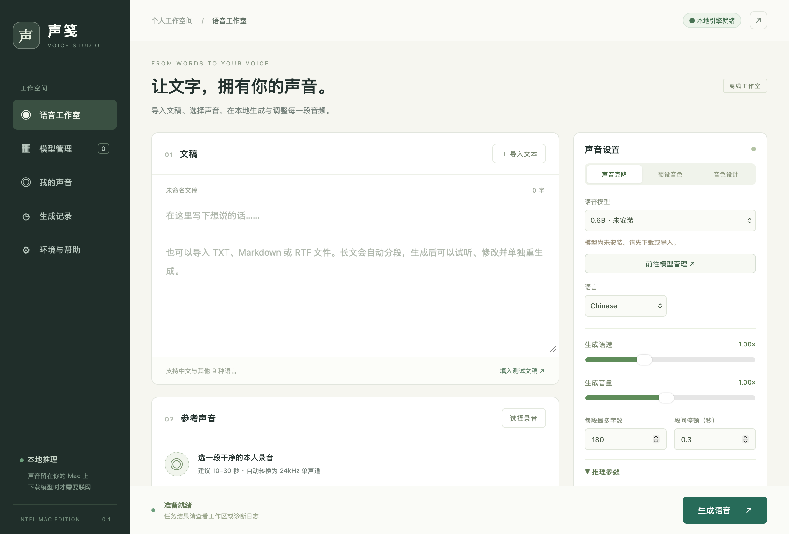

# 声笺 ShengJian

面向 Intel Mac 的本地语音工作室。用自己的录音克隆音色，导入文稿生成语音，在中文图形界面里修改分段、调整音频并导出 WAV。

**当前为 0.1.0 实验版本。** 应用编译目标是 Intel x86_64 / macOS 10.15，但尚未在 2019 Mac Pro 或旧版 macOS 上实测。已完成的生成测试来自 Apple Silicon + Rosetta，不代表真实 Intel 设备的性能或音色相似度。

这是独立的社区项目，采用 [Qwen3-TTS](https://github.com/QwenLM/Qwen3-TTS) 模型和 [gabriele-mastrapasqua/qwen3-tts](https://github.com/gabriele-mastrapasqua/qwen3-tts) 的 C 推理实现；不是 Qwen 官方应用，也不代表与模型发布方有合作或背书关系。



## 能做什么

- **本地声音克隆**：导入本人或获得授权的录音和对应文字，保存、复用声音档案。
- **文稿转音频**：导入 TXT、Markdown、RTF，支持常见中文编码；自动分段、逐段重生成、合并与 WAV 导出。
- **音频调整**：裁剪、音量、峰值归一化、淡入淡出、变速与变调，调整结果保存为副本。
- **模型管理**：魔搭 ModelScope（中国大陆，默认）与 Hugging Face 可选；显式切换来源、断点续传、固定版本、大小及哈希校验；也可导入已有的官方完整模型目录。
- **推理设置**：语言、线程、量化、随机种子、采样参数、参考音和部分高级选项。
- **自动准备运行环境**：内置原生 C 引擎；首次启动校验并安装到应用私有目录，损坏时可修复。无需安装 Python、PyTorch、Docker 或 Homebrew，也不自动更改系统环境。

本版没有训练、微调、GPU 加速、实时流式播放、任意模型架构支持或在线语音服务。界面覆盖的是本项目接入的推理能力，不是上游模型和命令行工具的全部功能。

## 下载与第一次使用

在 [Releases](https://github.com/cubebear/shengjian-voice-studio/releases) 页面下载 `ShengJian-Intel-0.1.zip` 和 `SHA256SUMS.txt`；也可以按下文从源码构建。

1. 核对下载文件的 SHA-256，解压并将 `ShengJian-Intel.app` 拖入“应用程序”。
2. 本版只有临时签名，没有 Apple Developer ID 签名或公证。确认来源及哈希后，如系统拦截，可使用 Finder 右键“打开”或系统安全设置允许这一个应用。不要全局关闭 Gatekeeper；如果提示文件损坏，先重新下载并核对文件。
3. 启动，等待显示“本地引擎就绪”。“环境与帮助”可查看检测结果和诊断日志。
4. 在“模型管理”选择下载来源，先下载 **0.6B Base**。所需文件约 2.52GB，建议为下载及临时文件留出至少 5GB 空间。
5. 准备一段只有自己说话、没有音乐的清晰录音，在工作室选择录音并填入对应原文。
6. 输入一句短文，使用初始参数生成，试听后再尝试长文。CPU 生成可能明显慢于音频实际时长。

详细安装、录音准备、参数说明、模型导入目录结构、分段修订和故障处理见 [手把手使用说明](使用说明.md)。

## 适用设备与测试范围

| 项目 | 当前情况 |
|---|---|
| 目标设备 | Intel Mac，重点面向 2019 Mac Pro 的 CPU 推理 |
| 最低编译目标 | macOS 10.15；不是已经实测的最低兼容版本 |
| CPU 引擎 | AVX2/FMA 与兼容引擎；未检测到 AVX2 时自动选择兼容引擎 |
| 内存 | 建议至少 16GB 起步，视模型与文本长度增加；未经目标设备测量 |
| 显卡 | 本版不使用 Mac Pro 的 AMD 显卡 |
| 已测环境 | Apple Silicon，macOS 26.6.2，经 Rosetta 运行 x86_64 应用 |
| 已测真实生成 | 0.6B Base，使用电脑合成的参考音，输出有效的 3.36 秒 WAV |
| 其他检查 | 26 项核心检查通过；两种引擎数值自检、原生启动和运行时修复通过 |

1.7B、CustomVoice、VoiceDesign 及部分实验参数虽已接入，但没有全部下载模型后逐一完成生成测试。Hugging Face 清单逻辑已测，真实大文件下载在测试网络超时；魔搭完成了 0.6B Base 的真实下载及校验。详见 [验证报告](验证报告.md)。

## 模型与下载源

模型权重**不随源码和安装包分发**。下载时会访问所选平台和它使用的文件 CDN；不会自动切到另一个平台。中国大陆网络是否可达仍取决于地区、运营商和时间，不作永久可用保证。

| 模型 | 用途 | 魔搭 | Hugging Face |
|---|---|---|---|
| 0.6B Base | 优先试用的声音克隆模型 | [下载](https://modelscope.cn/models/Qwen/Qwen3-TTS-12Hz-0.6B-Base) | [下载](https://huggingface.co/Qwen/Qwen3-TTS-12Hz-0.6B-Base) |
| 1.7B Base | 更大的声音克隆模型 | [下载](https://modelscope.cn/models/Qwen/Qwen3-TTS-12Hz-1.7B-Base) | [下载](https://huggingface.co/Qwen/Qwen3-TTS-12Hz-1.7B-Base) |
| 0.6B CustomVoice | 预设说话人 | [下载](https://modelscope.cn/models/Qwen/Qwen3-TTS-12Hz-0.6B-CustomVoice) | [下载](https://huggingface.co/Qwen/Qwen3-TTS-12Hz-0.6B-CustomVoice) |
| 1.7B CustomVoice | 预设说话人与风格指令 | [下载](https://modelscope.cn/models/Qwen/Qwen3-TTS-12Hz-1.7B-CustomVoice) | [下载](https://huggingface.co/Qwen/Qwen3-TTS-12Hz-1.7B-CustomVoice) |
| 1.7B VoiceDesign | 文字描述设计音色 | [下载](https://modelscope.cn/models/Qwen/Qwen3-TTS-12Hz-1.7B-VoiceDesign) | [下载](https://huggingface.co/Qwen/Qwen3-TTS-12Hz-1.7B-VoiceDesign) |

导入格式是官方 BF16 safetensors **完整目录**，不支持仅选择单个权重文件、LFS 指针、GGUF 或 MLX 转换版。界面的量化是引擎运行时量化。模型许可证独立于本应用，请遵守对应模型仓库的许可与声明。

## 隐私、授权与安全

录音、文稿、声音档案和生成结果保存在本机 `~/Library/Application Support/ShengJianStudio`。应用不实现云端推理或遥测，也不主动上传这些内容。模型下载会向所选服务暴露正常网络请求信息；系统备份、同步、浏览器或用户主动分享不受本项目控制。

只克隆本人或明确授权的声音。发布合成音频时清楚说明其合成性质，不用于欺诈、冒充真人或绕过声纹认证。声音向量与 `.qvoice` 也属于需要保护的素材；`.qvoice` 还可能包含少量模型权重，分享它时要同时考虑授权和模型许可。

[负责任使用说明](RESPONSIBLE_USE.md) 是用途与法律风险提示，不给 MIT 许可证增加字段限制；开源许可证也不授予任何人的声音、肖像或身份使用权。请勿导入来源不明的模型与声音文件；第三方原生解析器尚未经过完整安全审计。更多说明见 [SECURITY.md](SECURITY.md)。

## 从源码构建

需要 macOS、Xcode Command Line Tools 和 Python 3；这些是**构建工具**，最终应用运行不需要 Python。

```bash
python3 build.py
```

产物为 `dist/ShengJian-Intel.app`。脚本从随仓库提供的固定版本源码构建两个 Intel 引擎、编译 Swift、打包本地界面和许可证，再进行临时签名。不下载模型，不公证，不发布。

核心测试：

```bash
mkdir -p .build/test-cache .build/test-artifacts
xcrun swiftc -swift-version 5 -target x86_64-apple-macos10.15 \
  -module-cache-path .build/test-cache -framework AVFoundation \
  Sources/Core.swift Sources/Download.swift Tests/main.swift \
  -o .build/core-tests
.build/core-tests "$PWD/.build/test-artifacts" "$PWD/Tests/Fixtures"
```

音频测试需要正常桌面会话中的 macOS 音频服务；Apple Silicon 上运行此 Intel 测试还需要 Rosetta。[构建与结构说明](docs/BUILD.md) 包含 QA 构建入口。仓库中的 `Verification/` 保存历史测试证据，不代表每一台设备都会通过。

## 许可证与致谢

本项目原创的界面、Swift 封装及构建脚本采用 [MIT](LICENSE)。`Vendor/` 中第三方源码保留原有许可证；不能用本仓库根目录的 MIT 替代它们。包括 C 推理引擎、ingot、llama.cpp/ggml 派生量化表、LZ4 以及随源码保留的 KleidiAI 声明，详见 [第三方声明](THIRD_PARTY_NOTICES.md)。

Qwen3-TTS 模型由 Qwen 团队发布，使用其独立的 Apache-2.0 许可。感谢所有上游贡献者。项目按原样提供，不承诺特定设备兼容性、克隆质量或特定用途适用性。

问题反馈时请提供应用版本、macOS 版本、CPU/内存、所选模型及已脱敏的错误信息。请勿在公开 Issue 上传自己的录音、声音档案、完整文稿或密钥。
